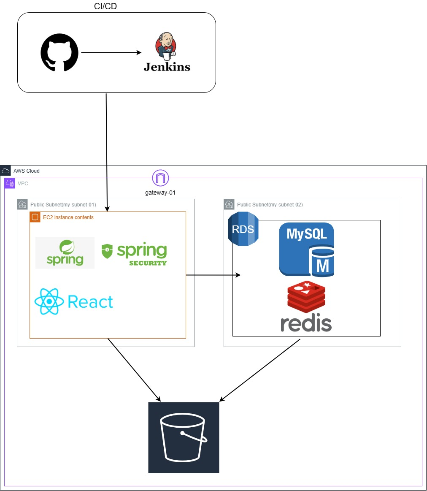
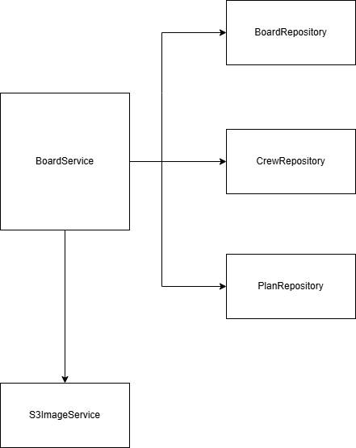
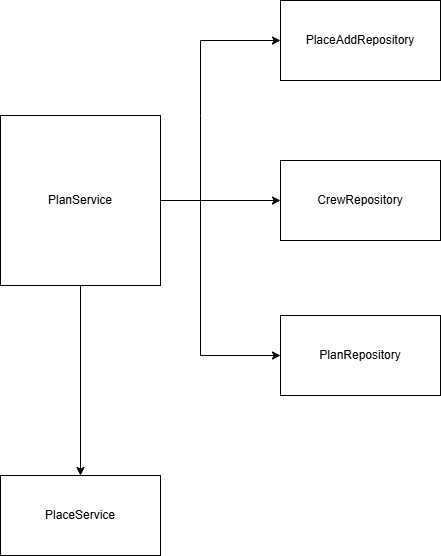
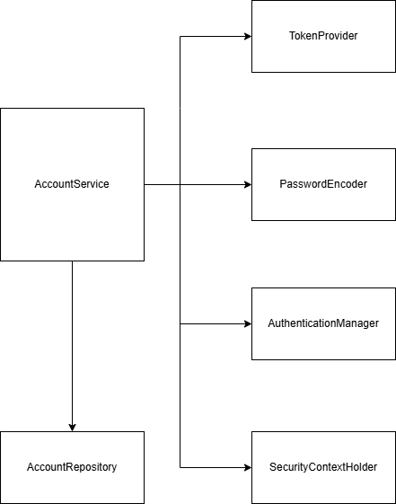

# Triplan

##  Repository Member

| 이름   | 주소                             |  
| ------ | ------------------------------------ |
| 김민지 |lby9906@naver.com| 
| 김수빈 |hbsubin1@naver.com| 
| 정승민 |rr22016@naver.com| 

## Reference Site

| 이름   |                             |  역할  |
| ------ | ------------------------------------ |------|
| 김민지 |lby9906@naver.com| 웹 개발 (Back-end)|
| 김수빈 |hbsubin1@naver.com| 웹 개발 (Front-end) |
| 정승민 |rr22016@naver.com| 웹 개발(Back-end) |

## ERD
https://www.erdcloud.com/d/k6aSQxnt3A6zBSXW6

## Fimga
https://www.figma.com/design/fibCnlSkB4lpAM68e6eitH/Untitled?node-id=0-1&node-type=CANVAS&t=A80qmHp7WteoRb9X-0

## Architecture

## API 설계

